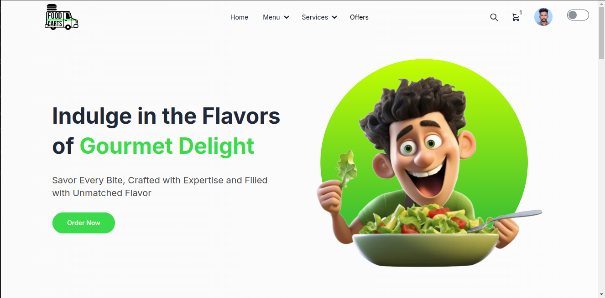
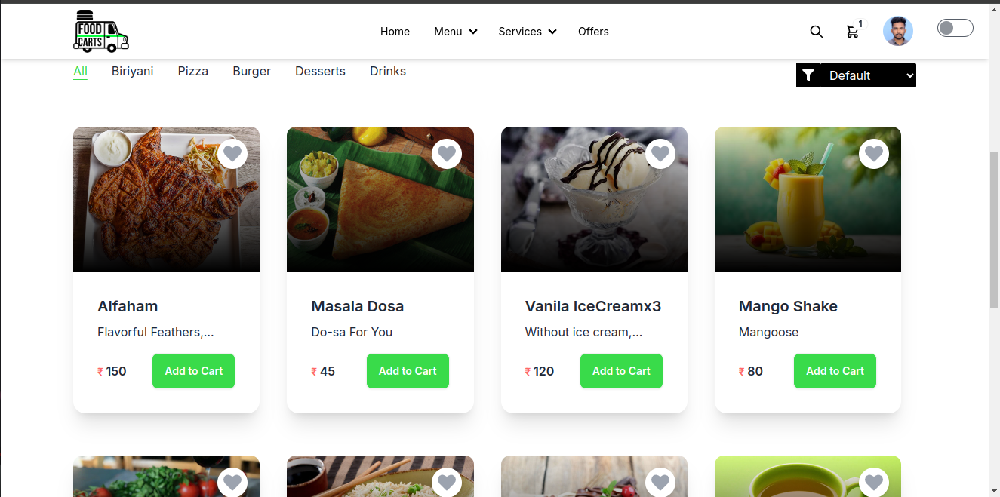
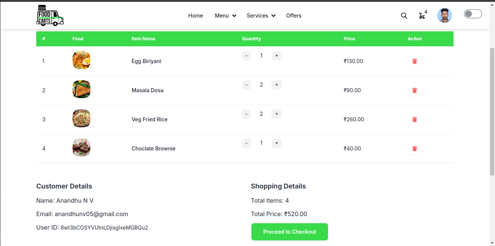
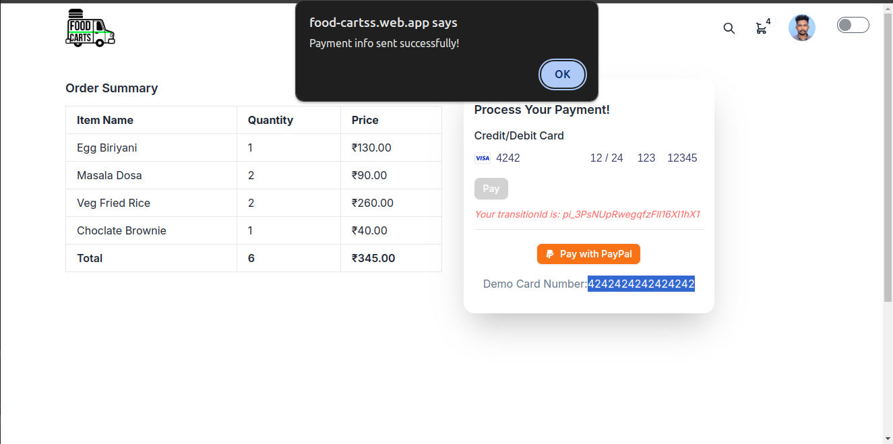
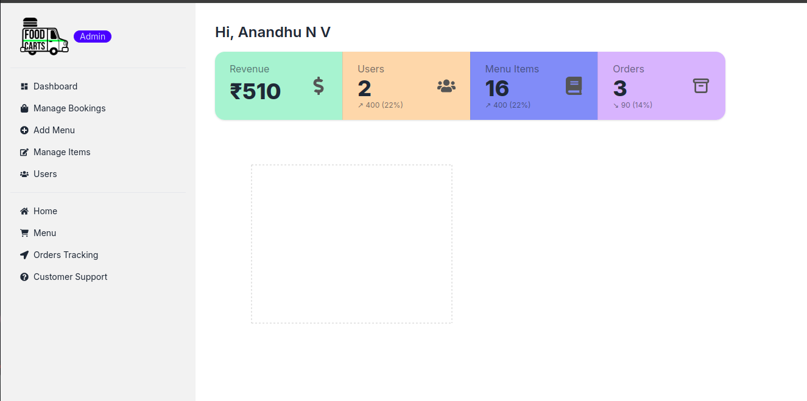
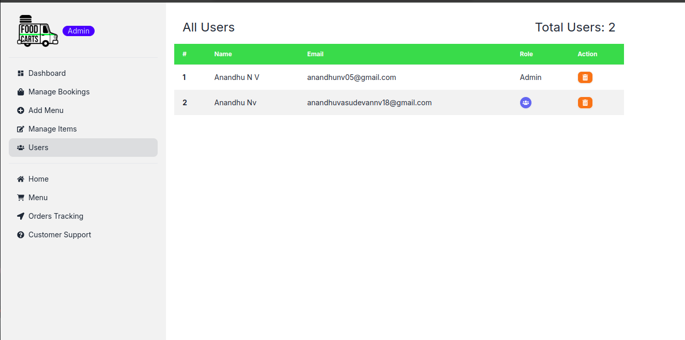
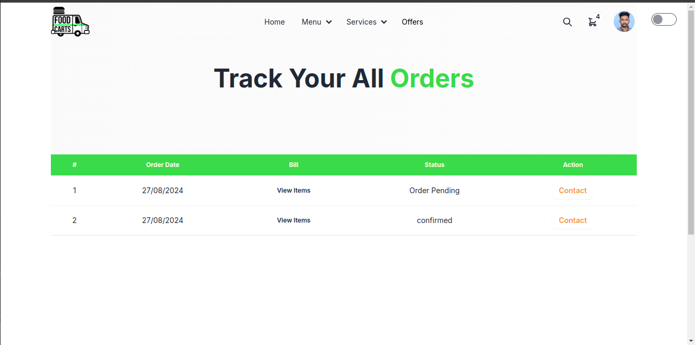
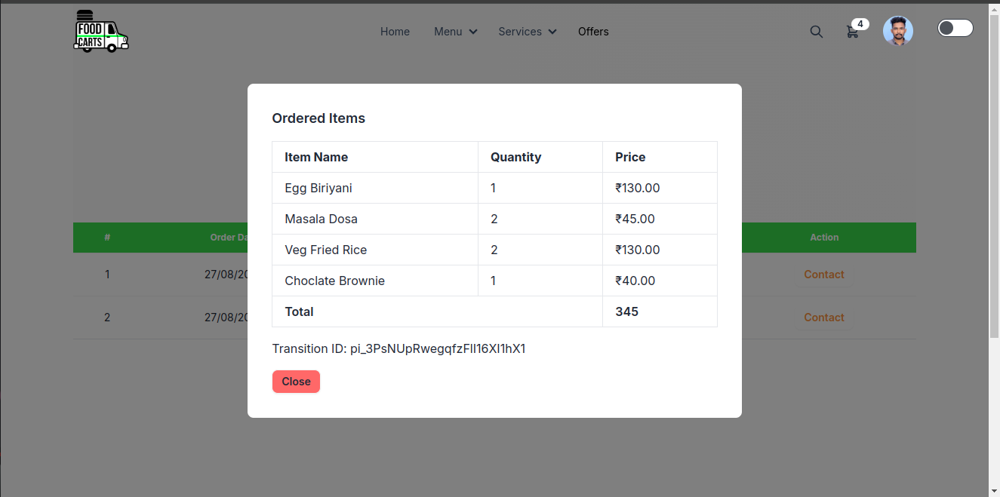

# FOOD-CARTS || FoodOrdering App

#### Home Page




Food-Carts is a full-stack food ordering application built with the MERN stack (MongoDB, Express, React, Node.js). It features user authentication, cart management, menu browsing, and Stripe integration for payment processing.

## Table of Contents

- [Features](#features)
- [Technologies](#technologies)
- [Installation](#installation)
- [Usage](#usage)
- [API Endpoints](#api-endpoints)
- [Deployment](#deployment)
- [Contributing](#contributing)
- [License](#license)

## Features

- **User Authentication**: Register, login, and manage user profiles securely using Firebase Authentication and JWT.
- **Menu Management**: Browse and search food items from a well-organized menu.
- **Cart Management**: Add items to the cart, adjust quantities, and proceed to checkout seamlessly.
- **Payment Integration**: Secure payment processing using Stripe.
- **Admin Dashboard**: Manage menu items, orders, and users with an intuitive interface.
- **Order Tracking & Customer Support**: Future features to enhance the overall customer experience.

## Technologies

- **Frontend**: React, Tailwind CSS, Vite
- **Backend**: Node.js, Express
- **Database**: MongoDB, Mongoose
- **Authentication**: Firebase Authentication, JWT
- **Payment Gateway**: Stripe
- **State Management**: React Context, React Query
- **Styling**: Tailwind CSS, DaisyUI
- **Icons**: React Icons

### Screenshots


#### Menu Page




#### Cart Page



#### Payment Page



#### Admin Dashboard




#### Users List Page




#### Track Orders Page




#### Bill Page




## Installation

### Backend

1. Clone the repository:

   ```bash
   git clone https://github.com/your-username/food-carts-server.git
   cd food-carts-server
   ```

2. Install dependencies:

   ```bash
   npm install
   ```

3. Set up environment variables:

   Create a `.env` file in the root directory and add the following:

   ```env
   PORT=5000
   DB_USER=yourMongoDBUsername
   DB_PASS=yourMongoDBPassword
   PAYMENT_SECRET_KEY=yourStripeSecretKey
   ACCESS_TOKEN_SECRET=yourJWTSecretKey
   ```

4. Start the backend server:

   ```bash
   npm start
   ```

### Frontend

1. Clone the repository:

   ```bash
   git clone https://github.com/your-username/food-carts-client.git
   cd food-carts-client
   ```

2. Install dependencies:

   ```bash
   npm install
   ```

3. Set up Firebase Authentication:

   Add your Firebase configuration in the frontend app by creating a `.env.local` file and adding the necessary Firebase credentials.

4. Start the frontend server:

   ```bash
   npm run dev
   ```

## Usage

1. **User Registration and Login**: Users can sign up and log in to their accounts to browse the menu and place orders.
2. **Menu Browsing**: Explore the available food items and choose your favorites.
3. **Cart Management**: Add food items to your cart, adjust quantities, and proceed to checkout.
4. **Admin Features**: Admins can access a dashboard to manage menu items, view orders, and manage users.
5. **Payment**: Securely pay for your order using Stripe.

## API Endpoints

- **POST /jwt**: Generate a JWT token for authentication.
- **GET /menu**: Fetch all available food items.
- **POST /carts**: Add an item to the cart.
- **GET /users**: Fetch user details.
- **POST /create-payment-intent**: Create a payment intent for Stripe payments.
- **GET /admin-stats**: View statistics for admins.
- **GET /order-stats**: View statistics for orders.

## Deployment

Deploy the backend on platforms like **Heroku** or **DigitalOcean**.
Deploy the frontend on platforms like **Netlify** or **Vercel**.

Make sure to update the environment variables with the correct values in the respective platforms for both frontend and backend.

## Contributing

Contributions are welcome! Please open an issue or submit a pull request if you'd like to contribute to the project.

1. Fork the repository.
2. Create your feature branch: `git checkout -b feature-name`
3. Commit your changes: `git commit -m 'Add some feature'`
4. Push to the branch: `git push origin feature-name`
5. Open a pull request.


## License

This project is licensed under the MIT License. See the [LICENSE](LICENSE) file for more details.
